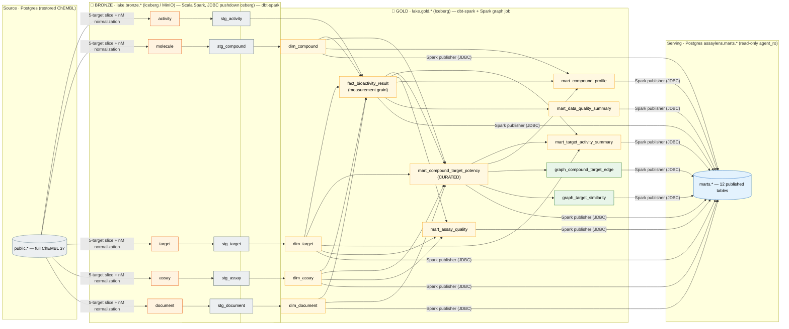
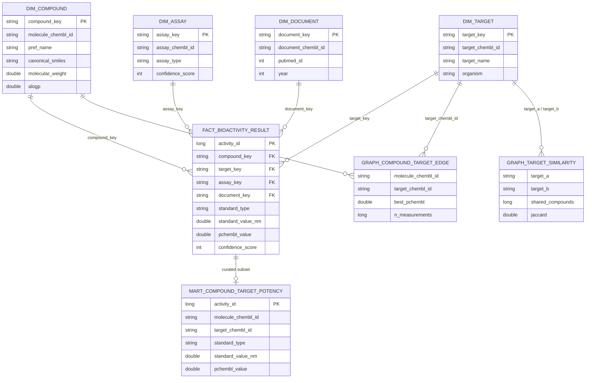

# 1 · Data-lake model & dependency graph

The medallion lakehouse (Apache Iceberg on MinIO) and the dbt/Spark **build
dependency graph** — every edge is a `ref()`/`source()` dependency, from the
ChEMBL source through Bronze → Silver → Gold and out to the Postgres serving marts.

## Star schema (serving grain)

`fact_bioactivity_result` is the measurement-grain fact; `mart_compound_target_potency`
is the curated subset; the two `graph_*` marts are derived relationship tables.

**Curation gate** — a `fact_bioactivity_result` row enters `mart_compound_target_potency`
only if: `standard_type ∈ {IC50,Ki,Kd,EC50}` · `standard_value_nm` not null · `pchembl_value`
not null · `confidence_score ≥ 7` · `data_validity_comment` null · `standard_relation` `=`/null.
