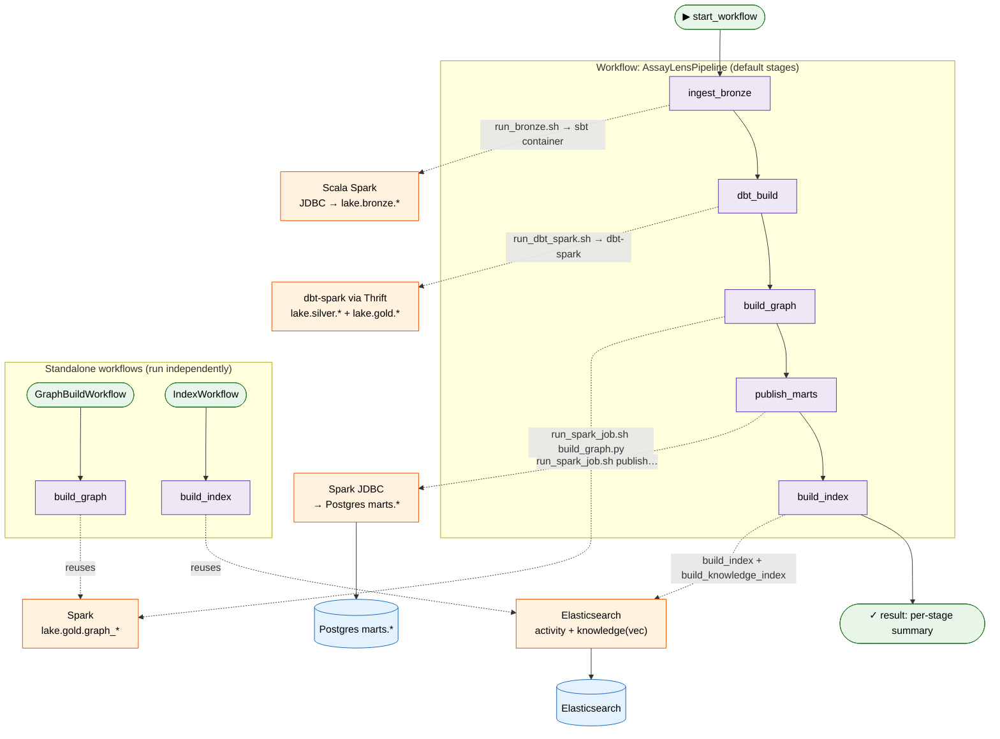
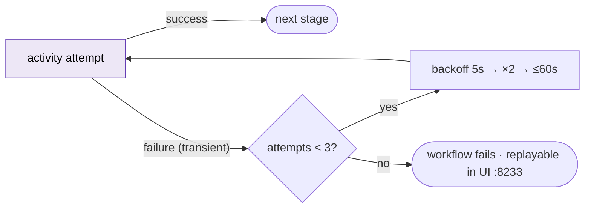

# 2 · Temporal workflows as DAGs

The medallion pipeline is a durable, replayable Temporal workflow. Each stage is
an **activity** (own timeout + retry policy) that the worker runs by launching a
job container via the Docker socket (docker-out-of-docker). The stage list is a
run parameter, and two **standalone workflows** re-run just the graph build or
the indexing without re-ingesting.

Task queue: `assaylens-pipeline` · Worker: `assaylens-pipeline-worker` ·
Per-activity: `start_to_close=30m`, `heartbeat=5m`, retry `3×` exp-backoff.

**Retry semantics (per activity):**

Run: `make pipeline-up && make pipeline-run` · single stage:
`… starter ingest_bronze` · standalone: `… starter --workflow graph_build|index`.
