# 3 · LangGraph governed copilot

The agent is a bounded LangGraph state machine — **route → execute → summarize** —
where the LLM only plans/summarizes and never touches data directly. The
`execute` node dispatches 1–3 of **12 governed tools**, each reading a specific
serving surface. Every request is one Langfuse trace; all DB access is via the
read-only `agent_ro` role behind SQL guardrails.

```mermaid
flowchart TB
  classDef node fill:#ede7f6,stroke:#5e35b1,color:#000;
  classDef llm fill:#fce4ec,stroke:#c2185b,color:#000;
  classDef tool fill:#e8eaf6,stroke:#3949ab,color:#000;
  classDef es fill:#fbe9e7,stroke:#d84315,color:#000;
  classDef pg fill:#e3f2fd,stroke:#1565c0,color:#000;
  classDef ext fill:#f1f8e9,stroke:#558b3a,color:#000;
  classDef guard fill:#ffebee,stroke:#c62828,color:#000;

  START(["POST /ask"]) --> ROUTE
  subgraph AGENT["LangGraph state machine · AgentState{request_id, question, plan, results, answer}"]
    direction TB
    ROUTE["route<br/>LLM plans 1–3 tool calls<br/>(intent_router.md, cached)"]:::llm
    EXEC["execute<br/>run planned tools in order"]:::node
    SUM["summarize<br/>LLM faithful answer<br/>(system_prompt.md, cached)"]:::llm
    ROUTE --> EXEC --> SUM
  end
  SUM --> FINISH(["answer + transparent steps"])

  EXEC --> TOOLS

  subgraph TOOLS["12 governed tools (registry)"]
    direction TB
    T1["search_assay_evidence"]:::tool
    T2["search_knowledge · VECTOR RAG"]:::tool
    T3["describe_warehouse"]:::tool
    T4["run_curated_sql"]:::tool
    T5["ask_warehouse · NL→SQL"]:::tool
    T6["get_compound_profile"]:::tool
    T7["get_compound_targets · graph"]:::tool
    T8["get_target_summary"]:::tool
    T9["get_target_neighbors · graph"]:::tool
    T10["explain_data_quality"]:::tool
    T11["get_metric_definition"]:::tool
    T12["get_metabase_dashboard"]:::tool
  end

  %% backends
  ES[("Elasticsearch<br/>activity_evidence")]:::es
  ESK[("Elasticsearch<br/>knowledge · dense_vector")]:::es
  EMB["Embedder<br/>all-MiniLM-L6-v2 (384d)"]:::ext
  PGRO[("Postgres marts.*<br/>via agent_ro (read-only)")]:::pg
  MB["Metabase<br/>signed embed URL"]:::ext
  GLOSS["static glossary"]:::ext

  GUARD["SQL guardrail · validate_sql<br/>SELECT-only · allow-list · LIMIT · timeout"]:::guard

  T1 --> ES
  T2 --> EMB --> ESK
  T2 --> ESK
  T5 -->|"LLM drafts SQL"| GUARD
  T4 --> GUARD
  GUARD --> PGRO
  T3 --> PGRO
  T6 --> PGRO
  T7 --> PGRO
  T8 --> PGRO
  T9 --> PGRO
  T10 --> PGRO
  T11 --> GLOSS
  T12 --> MB

  %% cross-cutting
  LLMSVC["Anthropic Claude Haiku<br/>+ response cache"]:::llm
  ROUTE -. uses .-> LLMSVC
  SUM -. uses .-> LLMSVC
  T5 -. uses .-> LLMSVC

  LF["Langfuse trace<br/>root span → LLM generations (token usage) → tool spans"]:::ext
  AGENT -. every /ask traced .-> LF
```

## Tool → surface → use cheat-sheet

| Tool | Backend | Answers |
|---|---|---|
| `search_assay_evidence` | Elasticsearch (full-text + filters) | "find IC50 < 100 nM EGFR assays" |
| `search_knowledge` | **Embedder → ES kNN (vector)** | "how are EGFR & HER2 related", "what is pChEMBL" |
| `describe_warehouse` | Postgres `information_schema` | "how many tables / what columns" |
| `run_curated_sql` | Guardrail → Postgres marts | user-supplied SELECT |
| `ask_warehouse` | LLM → guardrail → Postgres | NL→SQL ("top 10 by pChEMBL on JAK2") |
| `get_compound_profile` | Postgres marts | one compound's properties + evidence |
| `get_compound_targets` | `marts.graph_compound_target_edge` | a compound's target edges |
| `get_target_summary` | Postgres marts | counts, median potency, DQ |
| `get_target_neighbors` | `marts.graph_target_similarity` | targets sharing chemistry |
| `explain_data_quality` | `marts.fact_bioactivity_result` | why a row is in/excluded |
| `get_metric_definition` | static glossary | define IC50/Ki/Kd/pChEMBL… |
| `get_metabase_dashboard` | Metabase (signed JWT) | embeddable dashboard URL |

**Guardrails:** read-only `agent_ro` role · single SELECT (no DDL/DML/COPY/catalog) ·
mart allow-list · mandatory LIMIT + statement timeout · executed SQL/filters returned
for transparency. **Observability:** every request is a Langfuse trace (LLM token
usage per generation + a span per tool).
