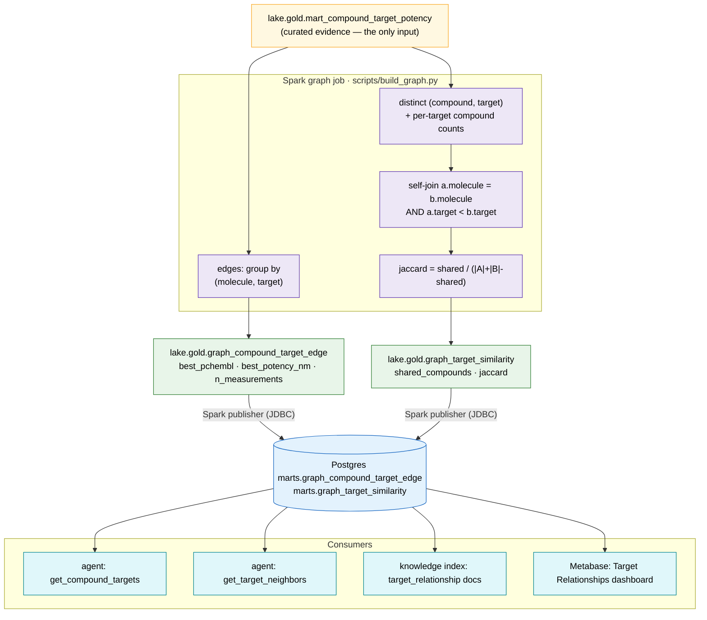

# 4 · Graph lineage

How the two GOLD relationship marts are derived. The Spark graph job
(`scripts/build_graph.py`) reads only the **curated** potency mart and produces
a compound↔target edge list and a target↔target similarity graph; the publisher
copies them to Postgres, where agent tools, the knowledge index, and Metabase
consume them.

**Edge mart** = one row per (compound, target): strongest curated pChEMBL, best
nM potency, and supporting measurement count. **Similarity mart** = one undirected
row per target pair sharing ≥1 curated compound, weighted by shared-compound count
and Jaccard over their curated compound sets. Both run in the Temporal
`build_graph` stage (or the standalone `GraphBuildWorkflow`).
