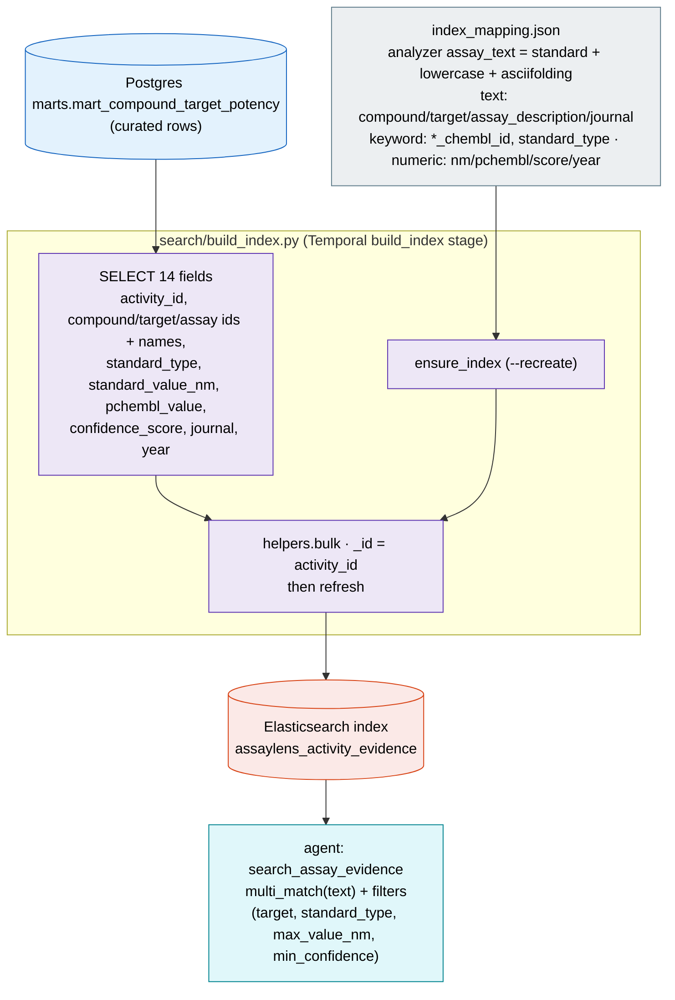

# 5 · Elasticsearch activity-evidence index

How the full-text search index is produced. `search/build_index.py` reads the
curated potency mart from Postgres and bulk-loads one document per
compound-target-assay measurement into the `assaylens_activity_evidence` index,
which the agent's `search_assay_evidence` tool queries.

Grain = one curated measurement (≈65k docs). Connects to Postgres as the
`assaylens` role (a write-side indexing job, not the read-only agent role). Run
via `make index` or the Temporal `build_index` activity (which also builds the
knowledge/vector index — see diagram 6).
