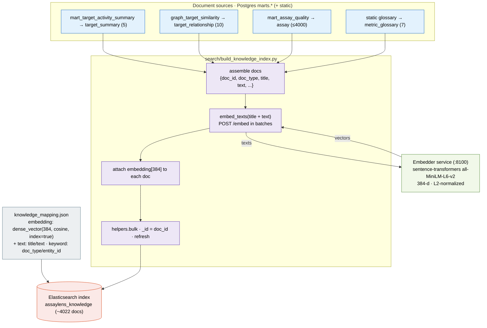
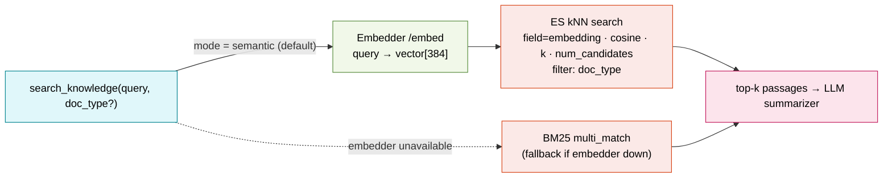

# 6 · Vector embeddings (semantic RAG)

How dense-vector embeddings are created and used. `search/build_knowledge_index.py`
assembles short knowledge documents from the marts, embeds them via the embedding
microservice (sentence-transformers `all-MiniLM-L6-v2`, 384-d), and stores them in
a `dense_vector` field. The agent's `search_knowledge` tool embeds the query and
retrieves by cosine **kNN** (with a lexical BM25 fallback).

## Build path

## Query path (what `search_knowledge` does)

Built in the same Temporal `build_index` stage as the activity-evidence index
(diagram 5). The embedding service is a shared microservice so the indexer and
the agent use one model copy; the MinIO/S3 secret in DuckDB and Spark is unrelated
to this path.
